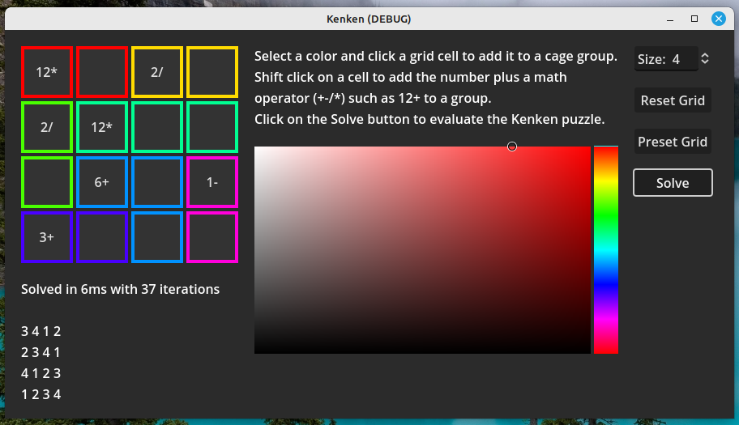

# Kenken

Kenken is a popular puzzle that appears online and in newspapers etc.

It consists of a square grid that needs to be filled with numbers. The available integers are from 1 to the size of the grid edge e.g. 1 - 4 for a 4x4 grid.

The number cells are grouped together in "cages" with a target total number using a math operator such as +. -, /, * to get the target with any combination of the caged numbers using the operator e.g. 3+2+4 = 9 where 9+ is specified in a cage of 3 cells.

The other rule is that no number may be repeated in a column or row of the grid.

Get example puzzles and more info. here: https://www.kenkenpuzzle.com/nydaily

## How this solver works

The user specifies the cage areas by coloring each cell. Then they enter the target number and operator symbol.

When solving, the grid is scanned to extract the cages as arrays of cell indices. It also stores the target number and operator in a class instance.

Now the various combinations of numbers that may be used to calculate the target numbers are derived. Then each of these cominations are permuted into all of the unique cominations of order of using the numbers e.g. 421,412,241,214,142 ...

Next, the number combinations are assigned to the grid according to where their cages are and the grid is tested for validity.

Eventually, a valid grid is discovered giving the solution to the puzzle.